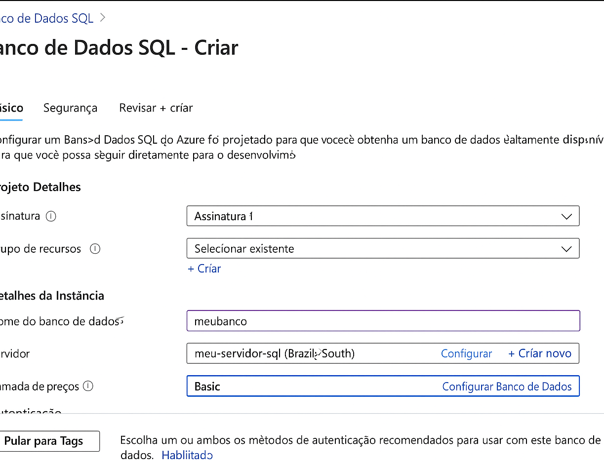
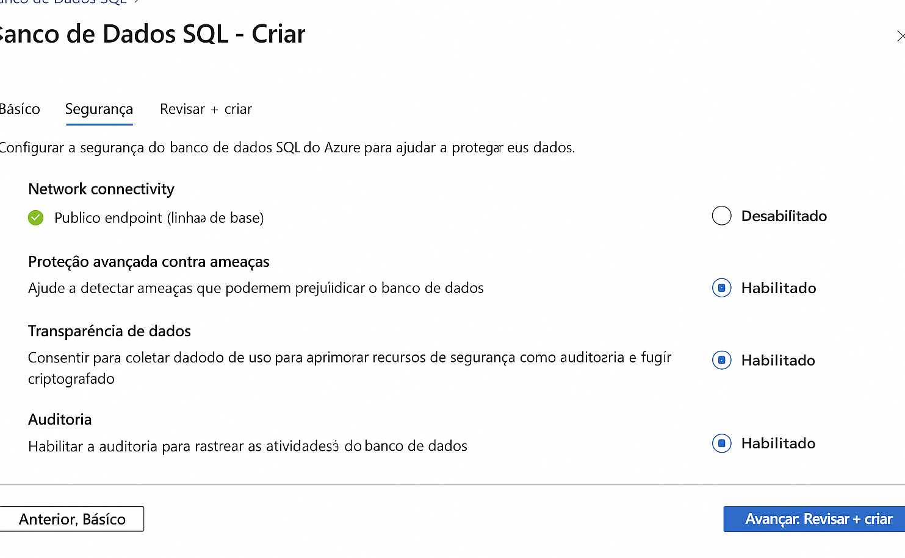
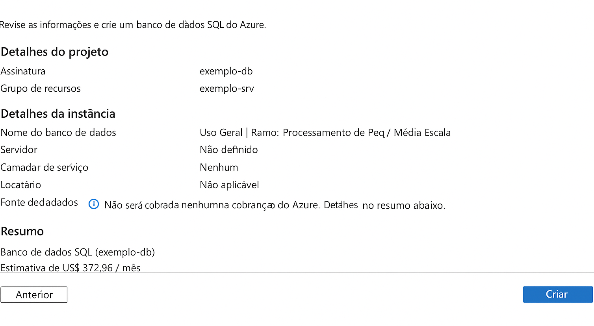

# 🌐 Laboratório de Banco de Dados no Microsoft Azure

Este repositório contém resumos, anotações e dicas práticas sobre a criação e configuração de uma instância de banco de dados no Microsoft Azure, conforme proposto no laboratório da disciplina de Computação em Nuvem.

## 📌 Objetivo

Praticar o processo de criação e configuração de uma instância de Banco de Dados na plataforma Microsoft Azure, além de documentar a experiência para servir de apoio em estudos futuros.

---

## ✅ Etapas Realizadas

### 1. Acesso ao Portal Azure

- Login no [portal.azure.com](https://portal.azure.com)
- Acesso ao recurso **Banco de Dados SQL**

### 2. Criação do Banco de Dados

- Recurso: **Banco de Dados SQL**
- Configurações utilizadas:
  - Nome do servidor: `meu-servidor-sql`
  - Nome do banco: `meubanco`
  - Localização: `Brazil South`
  - Camada de preço: `Basic`
- Habilitado login com usuário e senha

📸 Veja o processo:  

---

### 3. Configuração do Firewall

- Adicionado IP da minha máquina local nas configurações de firewall
- Permitido acesso de serviços do Azure

📸 Captura de tela:  

---

### 4. Conexão via SQL Server Management Studio (SSMS)

- Conectado com sucesso usando:
  - Servidor: `meu-servidor-sql.database.windows.net`
  - Autenticação: SQL Server Authentication
- Realizado teste com criação de tabela e inserção de dados

📸 Captura de tela:  

---

## 📝 Dicas e Observações

- Sempre verifique as regras de firewall ao tentar conectar via SSMS
- A camada gratuita **não está mais disponível** para SQL Database
- Use nomes únicos para o servidor, pois são globais
- Dá para baixar o IP da máquina atual automaticamente clicando no botão “+ Adicionar meu IP”

---

## 📚 Referências

- [Documentação Oficial - Banco de Dados SQL no Azure](https://learn.microsoft.com/pt-br/azure/azure-sql/)
- [Microsoft Learn - Módulo de introdução ao Azure SQL](https://learn.microsoft.com/pt-br/training/modules/introduction-to-azure-sql-database/)

---

## 📂 Organização

- `README.md`: documentação principal
- `/images`: capturas de tela do processo
- `notas.md`: anotações adicionais (opcional)

---

## ✍️ Autor

Nome: Jonatan Costa

